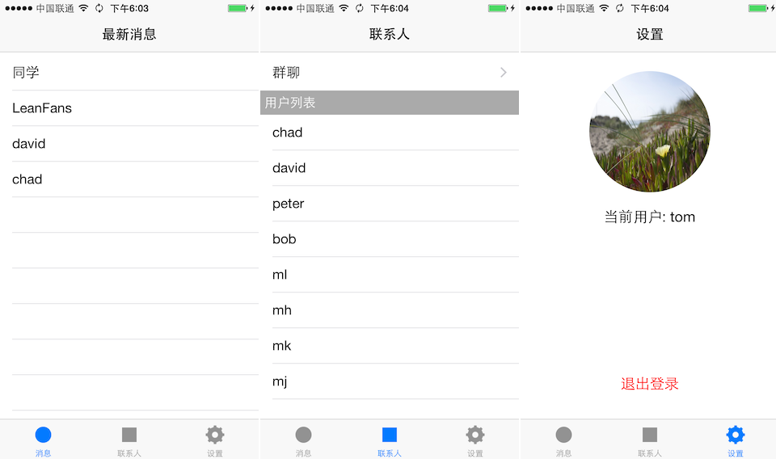

# FreeChat


FreeChat 是基于 [LeanCloud](https://leancloud.cn) 实时[消息服务](https://leancloud.cn/features/message.html)的一个聊天 app。

## 感谢

首先非常感谢你下载该 Demo，如果你觉得这个项目写的不够好，非常欢迎帮助我们来不断完善（通过```github pull request```即可）；如果你觉得有新的需求或者发现了 bug，欢迎给我们提 [Issue](https://github.com/jwfing/FreeChat/issues/new)。

## 如何运行
下载工程之后，直接在 Xcode 中打开 FreeChat.xcodeproj 即可。换成你自己的 appId／appKey 也可以直接运行（此时因为开放聊天室没有预先建立，所以开放聊天室页面下列表为空。要预先建立开放聊天室，可以参考 [LeanCloud 文档](https://leancloud.cn/docs/realtime_rest_api.html)）。

>> 注意：
>> FreeChat 使用了 LeanCloud 最新的 [CrashReporting Framework](https://leancloud.cn/docs/ios_crashreporting_guide.html)，所以编译前需要先安装 LeanCloud 用于上传符号表的客户端工具，具体方法如下：
>> `gem install --no-wrappers leancloud`

## 功能

FreeChat 的主要功能与微信类似。主要的模块分为三块：最新消息、联系人和设置，主界面如下图所示：



用户选择了一个联系人之后，就可以开始对话，对话界面如下图所示：


在这里用户可以发送文本、图片或者语音消息。而点击右上角的图标，则可以看到对话的详情，界面如下图所示：


在这里用户可以邀请其他人加入群聊，也可以踢出恶意发言的人，还可以修改群聊名称和设置是否接收离线通知，以及推出当前对话。

除此之外，FreeChat 也是需要用户注册、登录的。这部分功能的实现，则是基于 LeanCloud 的[数据存储](https://leancloud.cn/features/storage.html)服务完成的。

## 实现

### 消息响应

因为实时通信的消息是被动接收的，应用在不同的界面上都有可能收到新的消息。譬如：

- 在「最新消息」这个页面，如果来了新的消息，那么对应的「对话」后面可能要出现提示图标；
- 正好在对话页面的话，要是来了新的消息，就需要实时显示在消息列表中。

所以整体上我们采用了如下机制来响应新消息：

#### 类结构设计

* MainViewController 应用主窗口，登录之后就一直存在，实现了```AVIMClientDelegate```协议。它会把收到的新消息全部存入```ConversationStore```实例。
* IMEventObserver 接口，应用内用来通知新消息到达或者消息被对方接收等事件。主要接口有：

```
- (void)newMessageArrived:(Message*)message conversation:(AVIMConversation*)conversation;
- (void)messageDelivered:(Message*)message conversation:(AVIMConversation*)conversation;
```

* ConversationStore 全局单例，用来做消息缓存，并且也持有```AVIMClient```的实例。支持消息 Observer 的注册和取消，方法如下：

```
- (void)addEventObserver:(id<IMEventObserver>)observer forConversation:(NSString*)conversationId;
- (void)removeEventObserver:(id<IMEventObserver>)observer forConversation:(NSString*)conversationId;
```

设想使用方式如下（参照观察者模式）：

- 对于每一个希望响应新消息的 ViewController 来说，可以在```viewDidAppear```方法中把自己作为新消息观察者加入到```ConversationStore 全局单例```中；
- 在```viewWillDisappear```方法中从```ConversationStore 全局单例```中删除自己这个观察者。

#### 新消息响应时序图

总体上看，LeanCloud 实时通信云端到来的新消息，会经过如下时序反应到界面上来

```
LeanCloud云端    MainViewController  ConversationStore   ChatViewController(IMEventObserver)
          -- Msg -->  |                    |                       |
                      |-newMessageArrived->|                       |
                      |                    | -newMessageArrived->  |
```

目前主要有 ChatViewController 这一个观察者，RecentConversationViewController（最新消息）也应该作为观察者来实时响应，我现在还没有实现。

### 消息本地缓存

```ConversationStore```中会将消息缓存到本地，然后获取历史消息的时候，内部会结合本地缓存数据和 LeanCloud 云端一起来查询（本地有则从本地获取，否则走网络）。

本地消息缓存的方式如下：

- ```MessagePersister```协议类，支持消息 push 和 pull 两种操作；
- ```SQLiteMessagePersister``` 采用 SQLite 方式实现的本地数据库持久化类，实现了```MessagePersister```协议。
- ```RemoteMessagePersisiter``` 连接 LeanCloud 云端实现的消息持久化类，实现了```MessagePersister```协议（其实没有任何本地持久化，每次操作都需要走网络）。


### 用户账户管理

直接使用了 LeanCloud 自带的账户系统来管理，为了简单起见，也省略了用户之间的好友（follow）关系，允许用户可以和应用内任何一个注册用户聊天。

### 聊天界面上用户头像显示问题

由于 LeanCloud 实时通信服务是与用户账户系统解耦合的，所以对于ChatViewController 来讲，在显示每一条新消息的时候，要显示用户的信息（名字、头像或更多），就比较麻烦。因为从 sdk 里面我们只能拿到用户的 clientId，要从 clientId 再获取到用户的其他信息，可以：

- 每次通过 AVUser 的方法去异步获取，等操作结束之后更新界面。这样做的好处是可以保证每次取得的都是最新的数据，有效避免了用户换头像、改名等操作带来的数据不一致问题，但是坏处也很明显，会带来过多的网络请求。
- 通过一个全局的 AVUser 数据缓存来做，每次获取了新用户的信息之后就自动缓存起来，下次直接从缓存获取。这样的优缺点正好和前一种方法相反。

我们这里采用了后一种方法，因为毕竟界面显示的快速和节省流量是第一位的。方案如下：

- ```UserProfile``` 指代界面显示时需要的全部用户信息（demo 中用到了名字和头像）
- ```AVUserStore``` 提供带缓存的 UserProfile 异步获取接口。

### 消息离线通知

coming soon...

### 国内和美国节点

现在 LeanCloud 是支持美国节点的，FreeChat 也是确认可以在两个节点运行的。注意如下代码片段，即可在国内/美国节点之间进行切换：

```
file: AppDelegate.m

// 注意：如果您使用了 LeanCloud 美国节点，请保持这一行；
//      如果您使用 LeanCloud 国内节点，请注释掉这一行。
#define USE_US_CLUSTER 1

...

- (BOOL)application:(UIApplication *)application didFinishLaunchingWithOptions:(NSDictionary *)launchOptions {
    // Override point for customization after application launch.
#ifdef USE_US_CLUSTER
    [AVOSCloud useAVCloudUS];
    [AVOSCloud setApplicationId:@"l8j5lm8c9f9d2l90213i00wsdhhljbrwrn6g0apptblu7l90"
                      clientKey:@"b3uyj9cmk84s5t9n6z1rqs9pvf2azofgacy9bfigmiehhheg"];
    NSLog(@"use us cluster");
#else
    [AVOSCloud setApplicationId:@"xqbqp3jr39p1mfptkswia72icqkk6i2ic3vi4q1tbpu7ce8b"
                      clientKey:@"cfs0hpk9ai3f8kiwua7atnri8hrleodvipjy0dofj70ebbno"];
    NSLog(@"use cn cluster");
#endif

    ...
}
```

## 第三方库

所有功能都是基于 LeanCloud 平台完成的，所以第一感谢 LeanCloud。在本项目的开发过程中，还用到了如下第三方代码，在此一并表示感谢：

* [MJRefresh](https://github.com/CoderMJLee/MJRefresh) 不多说，用来下拉加载更多历史消息。
* [fmdb](https://github.com/ccgus/fmdb) sqlite 的 objective-c 封装，本项目中用来本地缓存历史消息。
* [UUChatTableView](https://github.com/ZhipingYang/UUChatTableView) 非常棒的一个聊天组件库，本项目中部分用来实现聊天界面。
* [AFNetworking](https://github.com/AFNetworking/AFNetworking) 不多说。
* voiceLib 半天没有找到来路，本项目中用来语音录入及格式转化成MP3。
